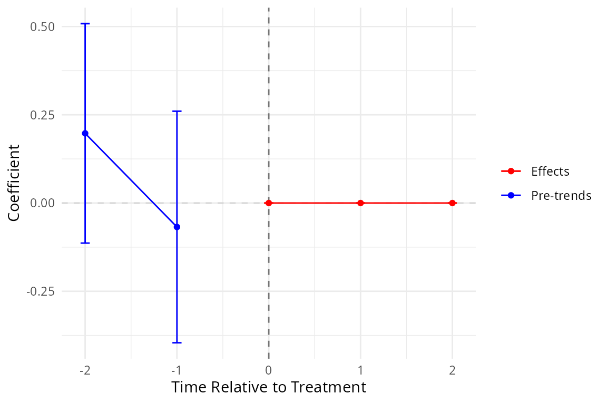
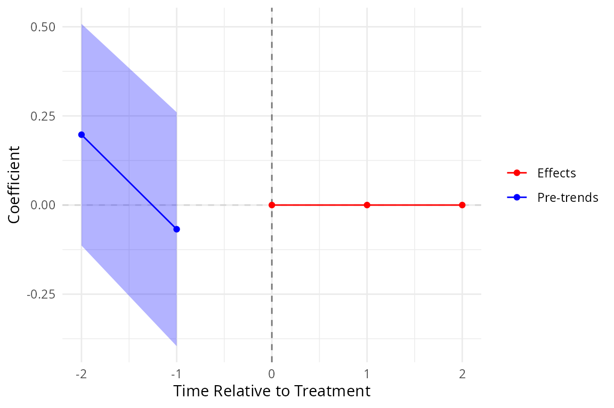

# Getting started with didimpute

## Overview

**didimpute** implements the imputation estimator of Borusyak, Jaravel
and Spiess (2024, *Review of Economic Studies*) for staggered
difference-in-differences (DiD) designs. The estimator proceeds in two
steps:

1.  Fit a two-way fixed effects (TWFE) model on *untreated* observations
    to obtain a counterfactual prediction $`\hat{y}_{it}(0)`$ for each
    treated observation.
2.  Aggregate the unit-level treatment effects
    $`\hat{\tau}_{it} = y_{it} - \hat{y}_{it}(0)`$ into
    researcher-specified estimands (average treatment effect on the
    treated, event-study coefficients, etc.).

Standard errors are cluster-robust and use the smartweights
influence-function approach of the original Python package.

## Installation

``` r
remotes::install_github("xiangao/didimpute")
```

## Data format

The estimator requires a long-format panel with:

- `i`: unit identifier
- `t`: time variable (integer-valued)
- `Ei`: first treated period (`NA` for never-treated units)
- `y`: outcome variable

``` r
library(didimpute)

# Synthetic staggered panel: 30 units, 10 periods
set.seed(42)
n_units <- 30; n_t <- 10

panel <- expand.grid(i = seq_len(n_units), t = seq_len(n_t))

# Three treatment cohorts: early (t=5), late (t=7), never-treated
panel$Ei <- ifelse(panel$i <= 10, 5L,
              ifelse(panel$i <= 20, 7L, NA_integer_))

# DGP: true effect = 1.5, with cohort heterogeneity
panel$y <- 1.5 * (!is.na(panel$Ei) & panel$t >= panel$Ei) +
             0.5 * (panel$i <= 10) * (!is.na(panel$Ei) & panel$t >= panel$Ei) +
             rnorm(nrow(panel), sd = 0.5)
```

## Baseline estimate

The simplest call returns the average treatment effect on the treated
(ATT) pooled across all treated observations.

``` r
res_ate <- did_impute(panel, y = "y", i = "i", t = "t", Ei = "Ei")
#> The number of treated entities is too small for some cohorts. Standard Errors may be wrong, consider using avgeffectsby option, averaging the the effect by treated X post variable.
print(res_ate)
#> <didimpute did_impute result>
#>   Effects: tau_ate=1.741 
#>   SE     : tau_ate=0.08701 
#>   N obs: 300
```

## Event-study estimates

Pass `horizons` to estimate separate effects at each relative-time
horizon. Use `pretrends` to also estimate placebo pre-trend
coefficients.

``` r
res <- did_impute(
  panel,
  y         = "y",
  i         = "i",
  t         = "t",
  Ei        = "Ei",
  horizons  = 0:2,
  pretrends = 2
)
#> WARNING: suppressing wtr0, consider lower minn or minn=0.
#> WARNING: suppressing wtr1, consider lower minn or minn=0.
#> WARNING: suppressing wtr2, consider lower minn or minn=0.

summary(res)
#>   term    estimate std.error
#> 1 tau0  0.00000000 0.0000000
#> 2 tau1  0.00000000 0.0000000
#> 3 tau2  0.00000000 0.0000000
#> 4 pre1 -0.06783874 0.1673345
#> 5 pre2  0.19735697 0.1585843
```

The summary returns a tidy `data.frame` with one row per estimand:
post-treatment effects (`tau0`, `tau1`, `tau2`) followed by pre-trend
placebo coefficients (`pre1`, `pre2`).

## Event-study plot

[`event_plot()`](https://xiangao.github.io/didimpute/reference/event_plot.md)
produces a `ggplot2` figure with pre-trends on the left and
post-treatment effects on the right.

``` r
if (requireNamespace("ggplot2", quietly = TRUE)) {
  event_plot(res)
}
```



The `rarea` variant draws a shaded confidence band instead of error
bars:

``` r
if (requireNamespace("ggplot2", quietly = TRUE)) {
  event_plot(res, plot_type = "rarea")
}
```



## Additional options

### Horizon-balanced sample (`hbalance`)

When `hbalance = TRUE`, the estimator restricts to cohorts observed at
*every* requested horizon, ensuring a balanced event-study sample.

``` r
res_bal <- did_impute(
  panel,
  y        = "y",
  i        = "i",
  t        = "t",
  Ei       = "Ei",
  horizons = 0:2,
  hbalance = TRUE
)
#> WARNING: suppressing wtr0, consider lower minn or minn=0.
#> WARNING: suppressing wtr1, consider lower minn or minn=0.
#> WARNING: suppressing wtr2, consider lower minn or minn=0.
summary(res_bal)
#>   term estimate std.error
#> 1 tau0        0         0
#> 2 tau1        0         0
#> 3 tau2        0         0
```

### All observed horizons (`allhorizons`)

``` r
res_all <- did_impute(
  panel,
  y           = "y",
  i           = "i",
  t           = "t",
  Ei          = "Ei",
  allhorizons = TRUE
)
#> WARNING: suppressing wtr0, consider lower minn or minn=0.
#> WARNING: suppressing wtr1, consider lower minn or minn=0.
#> WARNING: suppressing wtr2, consider lower minn or minn=0.
#> WARNING: suppressing wtr3, consider lower minn or minn=0.
#> WARNING: suppressing wtr4, consider lower minn or minn=0.
#> WARNING: suppressing wtr5, consider lower minn or minn=0.
summary(res_all)
#>   term estimate std.error
#> 1 tau0        0         0
#> 2 tau1        0         0
#> 3 tau2        0         0
#> 4 tau3        0         0
#> 5 tau4        0         0
#> 6 tau5        0         0
```

### Analytic weights

Pass the name of a weight column to `aw`:

``` r
panel$pop <- runif(nrow(panel), 0.5, 1.5)  # synthetic population weight
res_w <- did_impute(
  panel,
  y  = "y",
  i  = "i",
  t  = "t",
  Ei = "Ei",
  aw = "pop"
)
#> The number of treated entities is too small for some cohorts. Standard Errors may be wrong, consider using avgeffectsby option, averaging the the effect by treated X post variable.
print(res_w)
#> <didimpute did_impute result>
#>   Effects: tau_ate=1.751 
#>   SE     : tau_ate=0.09118 
#>   N obs: 300
```

### Skipping standard errors

For large panels, passing `nose = TRUE` skips the (expensive)
influence-function SE computation.

``` r
res_nose <- did_impute(
  panel,
  y    = "y",
  i    = "i",
  t    = "t",
  Ei   = "Ei",
  nose = TRUE
)
#> The number of treated entities is too small for some cohorts. Standard Errors may be wrong, consider using avgeffectsby option, averaging the the effect by treated X post variable.
print(res_nose)
#> <didimpute did_impute result>
#>   Effects: tau_ate=1.741 
#>   N obs: 300
```

## The `V` field

The returned object includes a square covariance matrix `V` of dimension
$`K \times K`$, where $`K`$ is the total number of reported estimands
(effects, then pre-trends, then controls, in that order). Row and column
names match the estimand names. `sqrt(diag(res$V))` reproduces the
reported per-estimand standard errors to numerical precision. This is a
deliberate improvement over the upstream Python package, whose `V` was a
scalar (sum of squared standard errors). `V` is `NULL` when
`nose = TRUE` or when no standard-error components are present.

## Unimplemented options

The following arguments match the Python package API but are not yet
implemented and will raise an error if supplied: `timecontrols`,
`unitcontrols`, `leaveoneout`, `hetby`, `project`.

## Reference

Borusyak, K., Jaravel, X., and Spiess, J. (2024). Revisiting Event-Study
Designs: Robust and Efficient Estimation. *Review of Economic Studies*,
91(6), 3253–3285.
